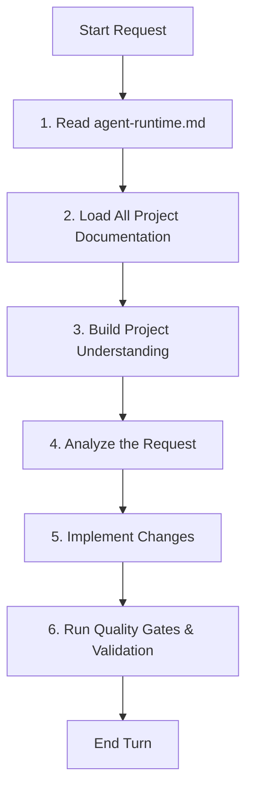

# Agent Runtime Protocol

This document governs the mandatory runtime-driven development execution workflow for all AI agents. It must be read first before analyzing any prompt, making decisions, or running code within the workspace.

---

## 🔄 Mandatory Startup Workflow



### 1. Read `agent-runtime.md`

- Locate and refresh the current agent runtime protocol first to establish the baseline execution flow.

### 2. Load All Project Documentation

- Inspect and read all files under `/docs/ai/` and the `/AI_ENGINEERING_CONSTITUTION.md` to ensure domain-specific rules are completely loaded into context.

### 3. Build Project Understanding

- Audit recent commits, active branch, current workspace status, and any cached implementation checklists.

### 4. Analyze the Request

- Plan changes with a strict focus on offline-first storage patterns, Mantine 9 styling, mobile safe-areas, and accessibility constraints.

### 5. Implement Changes

- Write code cleanly, preserving and maintaining existing comments. Break down complex elements into modular sub-components.

### 6. Run Quality Gates & Validation

- Proactively run standard formatting, linting, type-checking, and build validation commands:
  ```bash
  npm run format && npm run lint && npm run type-check && npm run build
  ```
- No execution task is complete until the validation pipeline runs and passes with an exit code of `0`.
