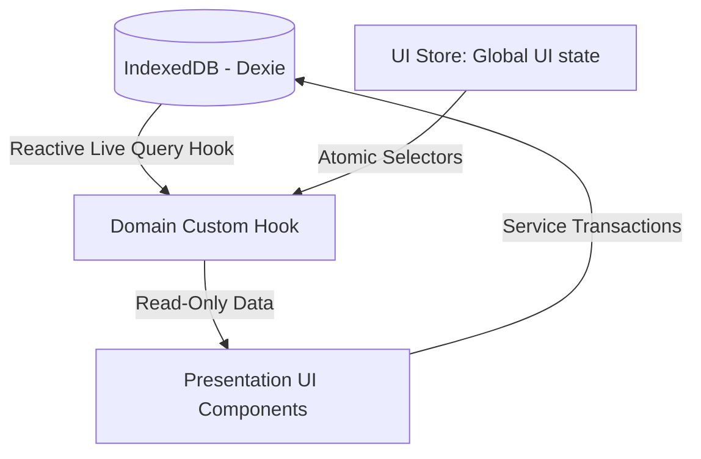

# Engineering Architecture Overview

This document outlines the system architecture, Feature-Sliced Design boundaries, Next.js app router patterns, persistence paradigms, and state flow hierarchies.

---

## 1. Feature-Sliced Design (FSD) Structure

The codebase is organized according to domain boundaries rather than infrastructure layers. This maximizes cohesion and allows components, services, and hooks representing a single business area to reside together.

```
src/
├── app/                  # Application initialization, global providers, App Router
├── features/             # Business modules (domain cohesion)
│   ├── inventory/        # Stock management domain
│   │   ├── components/   # Feature-specific UI
│   │   ├── hooks/        # Domain hooks and live queries
│   │   └── services/     # Dexie data access layer
│   └── invoices/         # Billing domain
│       ├── components/
│       ├── hooks/
│       ├── services/
│       └── utils/
├── shared/               # Universal elements shared across multiple domains
│   ├── components/       # SafeImage, BottomNavigation
│   ├── hooks/            # useNativeBack, usePreventExit
│   ├── store/            # Zustand global UI state
│   └── utils/            # Currency, date, image helpers
└── types/                # Global TypeScript definitions
```

### Module Boundaries & Folder Cohesion

Every feature folder contains a standardized sub-structure:

- `components/`: UI specific to that feature (forms, data tables, cards).
- `hooks/`: Domain-specific business logic hooks and live queries.
- `services/`: Data access layers, database connection files, and migrations.

> [!IMPORTANT]
> **Cross-Imports Rule:** Feature modules must be highly isolated. A component inside one feature domain may import public types or models from another feature domain, but must never directly import internal components or internal hooks from other features. If a UI element needs to be shared, it must be promoted to `src/shared/`.

---

## 2. Next.js App Router Architecture

### Static Export Model

The application uses `output: 'export'` for a fully static, client-side deployment. This means:

- **No API routes.** All data operations happen via IndexedDB.
- **No server components with data fetching.** Server components can exist for layout purposes, but all dynamic logic requires `'use client'`.
- **No server actions.** Form submissions go directly to Dexie service functions.

### Client Boundary Strategy

Because the app relies entirely on browser-level storage (IndexedDB), nearly all UI components and hooks require the `'use client'` directive.

**Rule:** Set client boundaries at the **highest page/layout node** to avoid redundant file-level declaration boilerplate. Child components imported within a client boundary are automatically client components.

```typescript
// src/app/page.tsx — sets the client boundary once
'use client';

import { InventoryDashboard } from '@/features/inventory/components/InventoryDashboard';

export default function HomePage() {
  return <InventoryDashboard />;
}
```

### Rendering Strategy

| Strategy             | When to Use                                             |
| -------------------- | ------------------------------------------------------- |
| **Server Component** | Root `layout.tsx` (metadata, fonts, providers wrapper)  |
| **Client Component** | Everything with state, effects, browser APIs, IndexedDB |
| **Dynamic Import**   | Heavy secondary features (PDF generation, data export)  |

---

## 3. Persistence Layer: Offline-First IndexedDB (Dexie)

This application has no central database server or remote API. It is an **offline-first, local-first browser application**.

- **IndexedDB via Dexie.js:** Provides a robust, developer-friendly B-tree indexing abstraction over browser IndexedDB.
- **Relational Mapping:** Database schemas are normalized to reduce duplicate storage. The primary schema includes:
  - `designs`: The catalog master table (primary lookup key with binary images).
  - `inventory`: Individual stock transactions (quantity and price deltas).
  - `parties`: Customer directory.
  - `invoices` & `invoiceItems`: Normalized billing history records.

### Database Versioning & Migrations

All database modifications must undergo strict, progressive schema versioning.

- Never modify past version declarations.
- Introduce schema increments by chaining new stores and performing data transformation inside dynamic upgrade callbacks.
- **Image Binary Optimization:** Raw images are stored as binary `Blob` objects rather than Base64 strings.

---

## 4. Decoupling Business Rules from DB Hooks

All complex mutations affecting multiple tables must be extracted into explicit service files.

```typescript
// Forbidden: Business logic inside infrastructure hooks
this.inventory.hook('creating', (primKey, obj, transaction) => {
  // Direct modification of designs table inside infrastructure hook
});
```

```typescript
// Correct: Service layer with explicit transactions
import { db } from './db';

export async function createStockTransaction(designNo: string, qty: number, price: number) {
  return await db.transaction('rw', [db.inventory, db.designs], async () => {
    await db.inventory.add({ designNo, quantity: qty, price, date: new Date().toISOString() });

    const design = await db.designs.get(designNo);
    if (design) {
      await db.designs.put({
        ...design,
        totalQuantity: design.totalQuantity + qty,
        totalValue: design.totalValue + qty * price,
        updatedAt: Date.now(),
      });
    }
  });
}
```

---

## 5. State Flow & UI Reactivity

The application orchestrates three types of state:



### 1. Database Reactive State

All data listing and statistics are read through reactive live query hooks. Whenever IndexedDB is modified, the queries automatically trigger UI updates without manual polling.

### 2. Global UI State (Zustand)

Universal application settings, UI active tabs, and navigation statuses are persisted in a single global store.

- Components must strictly query global UI state using **atomic selectors**:

  ```typescript
  // Correct — Re-renders only when activeTab changes
  const activeTab = useUIStore((state) => state.activeTab);

  // Forbidden — Re-renders on any store alteration
  const uiState = useUIStore();
  ```

### 3. Local UI State

Standard transient UI values (modal states, temporary form inputs) use React state and are kept as close to leaf nodes as possible.
