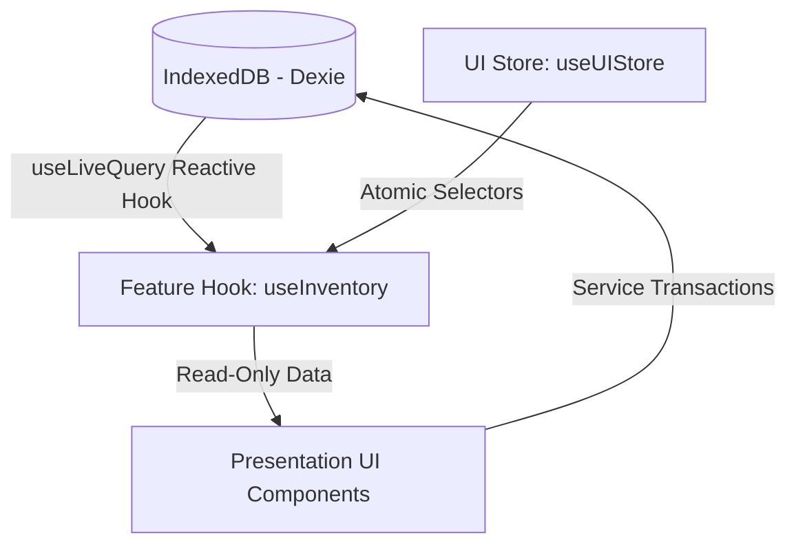

# Engineering Architecture Overview

This document outlines the client-side system architecture, the Feature-Sliced Design (FSD) boundaries, persistence paradigms, and state flow hierarchies that govern this application.

---

## 1. Feature-Sliced Design (FSD) Structure

The codebase is organized according to domain boundaries rather than infrastructure layers. This maximizes cohesion and allows components, services, and hooks representing a single business area to reside together.

```
src/
├── app/                  # Application initialization, global providers, App Router
│   ├── Providers.tsx     # Theme Provider and global modal definitions
│   └── globals.css       # Clean global overrides and base variables
├── features/             # Business modules
│   ├── inventory/        # Stock management and design catalogs
│   └── invoices/         # Billing and PDF generation
└── shared/               # Universal elements shared across multiple domains
    ├── components/       # Primitives (e.g., SafeImage, BottomNavigation)
    ├── hooks/            # Universal helpers (e.g., useMediaQuery)
    ├── store/            # Global UI state (Zustand)
    └── theme/            # Shared theme overrides and styles
```

### Module Boundaries & Folder Cohesion

Every feature folder (e.g., `src/features/inventory/`) contains a standardized sub-structure:

- `components/`: UI specific to that feature (e.g., [AddStockForm.tsx](file:///home/ghanshyam/.gemini/antigravity/scratch/stock-management-app/src/features/inventory/components/AddStockForm.tsx)).
- `hooks/`: Domain-specific business logic hooks and queries (e.g., [useInventory.ts](file:///home/ghanshyam/.gemini/antigravity/scratch/stock-management-app/src/features/inventory/hooks/useInventory.ts)).
- `services/`: Data access layers, repositories, database connections, and migrations (e.g., [db.ts](file:///home/ghanshyam/.gemini/antigravity/scratch/stock-management-app/src/features/inventory/services/db.ts)).

> [!IMPORTANT]
> **Cross-Imports Rule:** Feature modules must be highly isolated. A component inside `features/invoices` may import public types or models from `features/inventory`, but must never directly import internal components or internal hooks from other features. If a UI element needs to be shared, it must be promoted to the `shared/` directory.

---

## 2. Persistence Layer: Offline-First IndexedDB (Dexie)

This application has no central database server or remote API. It is an **offline-first, local-first browser application**.

- **IndexedDB via Dexie.js:** Dexie.js provides a robust, developer-friendly B-tree indexing abstraction over browser IndexedDB.
- **Relational Mapping:** Database schemas are normalized to reduce duplicate storage. The primary schema includes:
  - `designs`: The catalog master table, housing unique design names and binary images (`designNo` is the primary key).
  - `inventory`: Individual stock transactions (quantity and price deltas mapped to specific `designNo` entries).
  - `parties`: Customer directory.
  - `invoices` & `invoiceItems`: Normalized billing history records.

### Database Versioning & Migrations

All database modifications must undergo strict, progressive schema versioning in [db.ts](file:///home/ghanshyam/.gemini/antigravity/scratch/stock-management-app/src/features/inventory/services/db.ts).

- Never modify past `.version(X)` declarations.
- Introduce schema increments by chaining `.version(Y).stores({ ... })` and performing data transformation inside `.upgrade(async tx => { ... })`.
- **Image Binary Optimization:** As of database version 3, raw images are stored as binary `Blob` objects rather than Base64 strings. This increases lookup speeds by 10x and eliminates memory spikes in mobile WebKit.

---

## 3. Decoupling Business Rules from DB Hooks

Historically, database aggregates (such as keeping `designs` catalog totals synced whenever an `inventory` row is written) were handled inside Dexie hook interceptors:

```typescript
// Legacy Anti-Pattern inside db.ts
this.inventory.hook('creating', (primKey, obj, transaction) => {
  // Direct modification of designs table triggered inside infrastructure hook
});
```

This infrastructure-coupled design is highly discouraged because:

1. It is hard to mock or unit test business calculations.
2. Error failures are swallowed inside low-level IndexedDB threads.
3. Batch operations trigger an avalanche of individual Read-Modify-Write disk transactions.

### Refactored Pattern: Repository/Service Layer

All complex mutations affecting multiple tables must be extracted into explicit service files:

- Maintain business logic within dedicated services (e.g., `inventoryService.ts`).
- Perform multiple table operations within a unified, atomic transaction block:

  ```typescript
  import { db } from './db';

  export async function createStockTransaction(designNo: string, qty: number, price: number) {
    return await db.transaction('rw', [db.inventory, db.designs], async () => {
      // 1. Insert transaction entry
      await db.inventory.add({ designNo, quantity: qty, price, date: new Date().toISOString() });

      // 2. Fetch and aggregate designs table
      const design = await db.designs.get(designNo);
      if (design) {
        await db.designs.put({
          ...design,
          totalQuantity: design.totalQuantity + qty,
          totalValue: design.totalValue + qty * price,
          updatedAt: Date.now(),
        });
      }
    });
  }
  ```

---

## 4. State Flow & UI Reactivity

The application orchestrates three types of state to ensure real-time UI updates with high rendering efficiency.



### 1. Database Reactive State

All data listing and statistics are read through `useLiveQuery` inside feature hooks. Whenever IndexedDB is modified (via transactions or service layers), `useLiveQuery` automatically triggers, causing the relevant React component to update without any manual polling or global context dispatchers.

### 2. Global UI State (Zustand)

Universal application settings, UI active tabs, and navigation statuses are persisted in a single global store: [useUIStore.ts](file:///home/ghanshyam/.gemini/antigravity/scratch/stock-management-app/src/shared/store/useUIStore.ts).

- Components must strictly query global UI state using **atomic selectors**:

  ```typescript
  // Correct - Re-renders only when activeTab changes
  const activeTab = useUIStore((state) => state.activeTab);

  // Forbidden - Re-renders on any store alteration
  const uiState = useUIStore();
  ```

### 3. Local UI State

Standard transient UI values (e.g., modal states, temporary form inputs, text values) use React `useState` and are kept as close to leaf nodes as possible.
