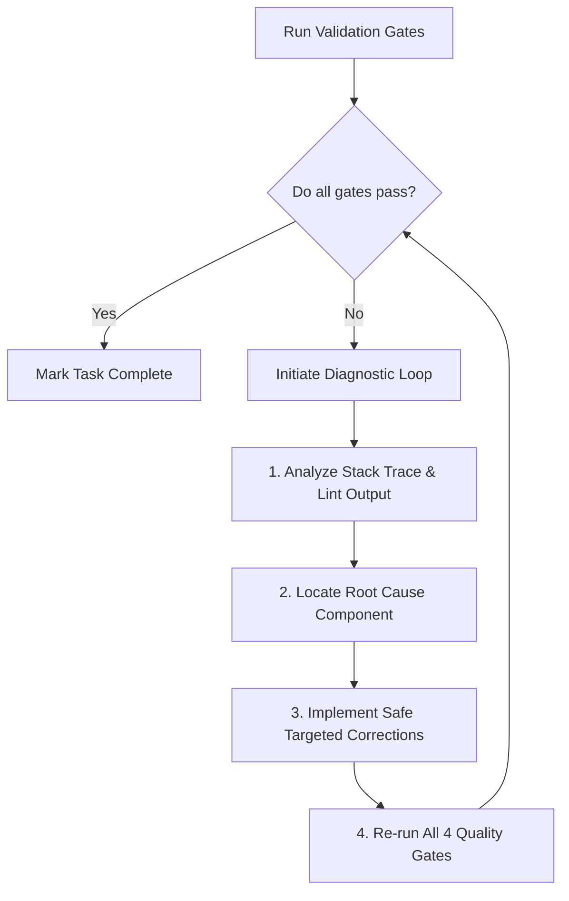

# AI Engineering Quality Gates

This document establishes the mandatory quality gate validation system. No AI implementation, bug fix, or refactoring task can be considered complete until all validation pipelines pass successfully.

---

## 1. Audited Project Quality Commands

Based on our thorough audit of [package.json](file:///home/ghanshyam/.gemini/antigravity/scratch/stock-management-app/package.json), workspace settings, pre-commit hooks, and configurations, the exact commands for all 6 target quality gates are:

### format

- **Exact Command:** `npm run format`
- **Audited Execution:** Runs `prettier --write .` to format all TS, TSX, CSS, JSON, and MD files across the workspace.

### lint

- **Exact Command:** `npm run lint`
- **Audited Execution:** Runs `eslint` to validate code quality, React standards, hooks usage, and accessibility constraints (`jsx-a11y`).
- _Auto-Fix Command:_ `npm run lint:fix` (runs `eslint --fix` for minor issues).

### typecheck

- **Exact Command:** `npm run type-check`
- **Audited Execution:** Runs `tsc --noEmit` to verify type safety and compilation soundess without outputting build files.

### test

- **Exact Command:** `N/A` (No unit testing suite or runner, such as Jest or Vitest, is currently configured in `package.json` or hooks).
- **Audited Execution:** If test suites are introduced in a future version upgrade, the command will be mapped as `npm run test`.

### build

- **Exact Command:** `npm run build`
- **Audited Execution:** Runs `next build` to compile the application, package all styles, optimize static content, and verify bundler success.

### affected tests

- **Exact Command:** `N/A` (No target runner or selective change detection tool, such as Jest related-tests, is configured in the repository).
- **Audited Execution:** If introduced in future version upgrades, selective testing would be run using Git diffs or specific test tags (e.g., `npx jest --findRelatedTests`).

---

## 2. Playbooks by Change Type

Depending on the area of code changed, you must run specific validation plays:

### UI Changes

_Applies to changes in layouts, Mantine components, responsiveness, themes, or modals._

1. **`npm run format`**: Re-align all JSX indentation and standard tokens.
2. **`npm run lint`**: Catch `jsx-a11y` accessibility failures or missing interactive keyboard event bindings.
3. **`npm run build`**: **CRITICAL FOR UI.** Many CSS post-processors, PostCSS Mantine variables, and component nesting bugs only trigger errors during Next.js production builds.
4. **Manual Verification**: Run `npm run preview` to inspect the visual shifts and verify dark/light mode body colors.

### Business Logic Changes

_Applies to changes in IndexedDB schemas, transactions, Dexie services, or custom React hooks._

1. **`npm run type-check`**: **CRITICAL FOR LOGIC.** Guarantees that Dexie database table entities, service parameters, and state managers (Zustand hooks) match signatures exactly.
2. **`npm run lint`**: Inspect code for any implicit standard violations, such as raw `any` castings or unhandled promise aggregations.
3. **`npm run build`**: Ensure that static optimization passes compile database-dependent hooks and page queries clean.

### Shared Component Changes

_Applies to changes in global primitives (e.g., `<SafeImage>`, navigation panels, theme providers)._

1. **`npm run type-check`**: Check all calling instances across different features to verify that props match and there are no regressions.
2. **`npm run lint`**: Verify accessibility and eslint conformity.
3. **`npm run build`**: Ensure compiler builds the entire dependency graph successfully.

---

## 3. git Pre-Commit Hooks (Husky Configured)

The repository automatically executes the following scripts inside [.husky/pre-commit](file:///home/ghanshyam/.gemini/antigravity/scratch/stock-management-app/.husky/pre-commit) before committing any changes:

1. `npm run type-check`
2. `npx lint-staged` (Runs Prettier formatting and ESLint auto-fixes on staged files)

Commit messages are validated using `commitlint` inside [.husky/commit-msg](file:///home/ghanshyam/.gemini/antigravity/scratch/stock-management-app/.husky/commit-msg).

---

## 4. Failure Recovery Workflow

If any validation step fails, the agent is **prohibited** from marking the task as complete. The agent must immediately trigger the following diagnostic recovery loop:

### Protocol for Corrective Action

1. **Analyze Errors:** Carefully inspect stack traces, line-number coordinates, and warning descriptions.
2. **Isolate Root Cause:** Map the failure directly to the specific import, mismatched property, or custom style override.
3. **Targeted Fixes:** Correct the code without introducing collateral changes or breaking existing backward compatibility.
4. **Iterative Verification:** Re-execute all quality gates (Formatting, Linting, Type-checking, and Building) to ensure that the fix resolves the original issue and introduces no regressions.
5. **Repeat** until all verification checks compile and build 100% clean.

---

## 5. Strict Compliance

> [!IMPORTANT]
> **No Exemptions:** Under no circumstances should compilation warnings, formatting inconsistencies, or linter errors be bypassed. The quality gate checks represent the absolute gatekeeper of codebase reliability.
